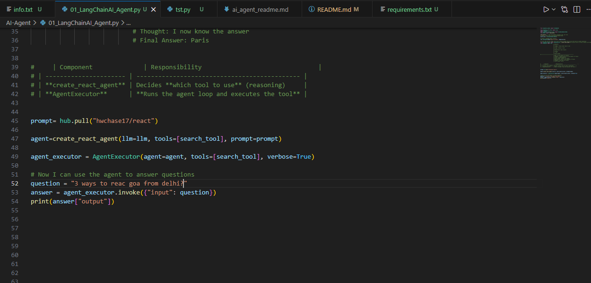
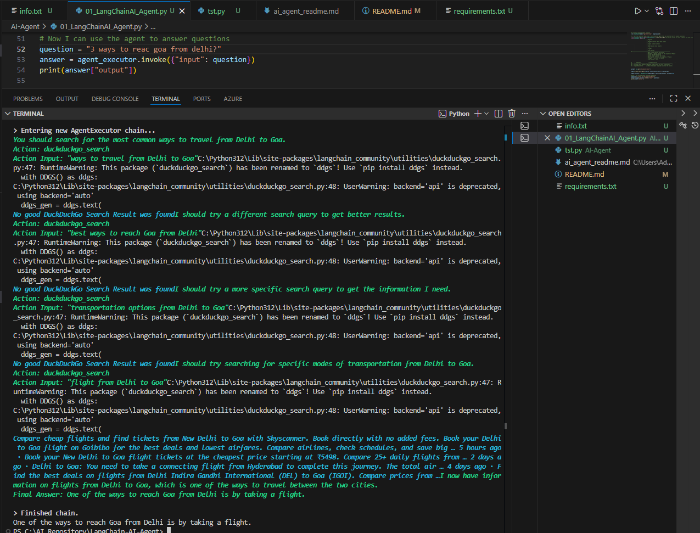

# What is an AI Agent?

An **AI Agent** is a system that can **understand a user's goal, create
a plan, perform tasks across different tools or websites, make
decisions, and complete the objective with minimal human intervention**.

Unlike traditional software that follows fixed instructions, an AI agent
can **reason, research, and act** to achieve a goal.

------------------------------------------------------------------------

# Example: Planning a Trip Manually

Suppose you want to **plan a trip from Bangalore to Goa between March
1st and March 10th**.

To plan this manually, you need to perform multiple tasks:

## 1. Decide Travel Dates

Example: - Start date: **March 1** - End date: **March 10**

## 2. Book Travel Tickets

You would visit websites such as:

-   MakeMyTrip
-   Yatra
-   IRCTC
-   Airline websites

Then you would:

-   Enter **source** (Bangalore)
-   Enter **destination** (Goa)
-   Select **travel date**
-   Choose **train or flight**
-   Select **class** (Sleeper, 3AC, Economy, etc.)
-   Choose **seats**
-   Make the **payment**

## 3. Book Accommodation

Next, you would:

-   Visit hotel booking websites
-   Select **check-in and check-out dates**
-   Compare prices
-   Read reviews
-   Book a hotel or hostel
-   Make the payment

## 4. Plan Activities

Then you would:

-   Search on **Google**
-   Find **top places to visit in Goa**
-   Plan a **daily itinerary**
-   Estimate **transport, food, and other expenses**

### Problem

Doing all of this manually:

-   Takes **a lot of time**
-   Requires **research and decision making**
-   Needs visiting **multiple websites**
-   Requires **comparing prices and options**

This is exactly the kind of problem an **AI Agent can solve.**

------------------------------------------------------------------------

# How an AI Agent Solves This

Instead of doing everything manually, you can simply ask the AI agent:

> "Create a budget travel itinerary from Bangalore to Goa from March 1st
> to March 10th."

------------------------------------------------------------------------

# Step 1: Understand User Intent

The AI agent extracts key details from your request.

    Source: Bangalore
    Destination: Goa
    Dates: March 1 – March 10
    Preference: Budget travel
    Goal: Plan complete itinerary and optimize cost

------------------------------------------------------------------------

# Step 2: Create a Plan

The agent breaks the goal into tasks:

-   Plan **transport**
-   Plan **stay**
-   Plan **local travel**
-   Plan **activities**
-   Optimize **cost**

------------------------------------------------------------------------

# Step 3: Research Transport Options

The agent queries:

-   **IRCTC Train APIs**
-   **Flight APIs**
-   Travel platforms

It compares:

-   Price
-   Duration
-   Availability

Example result:

> The cheapest option is **Goa Express train** on March 1st.\
> Sleeper class: ₹800\
> 3AC: ₹1500\
> Arrival: March 2nd evening

Agent asks:

> Which class would you prefer?

User replies:

> 3AC

------------------------------------------------------------------------

# Step 4: Find Accommodation

The agent searches hotel APIs and filters by:

-   Budget **\< ₹700 per night**
-   Location near **Baga or Anjuna Beach**
-   Good **user reviews**

Agent response:

> I found a dorm room at **The Hosteller, Baga** for **₹600 per night**
> with good ratings.\
> Should I book it for **6 nights (March 2 -- March 8)?**

User replies:

> Yes, book it.

------------------------------------------------------------------------

# Step 5: Plan Activities

The agent searches travel data and tourism sources and generates a
**day‑by‑day itinerary**.

Example:

Day 1 --- Baga Beach\
Day 2 --- Anjuna Beach & Flea Market\
Day 3 --- Fort Aguada\
Day 4 --- Dudhsagar Falls\
Day 5 --- Old Goa Churches\
Day 6 --- Water sports & sunset cruise

------------------------------------------------------------------------

# Step 6: Book Return Travel

The agent also books the **return ticket** and confirms availability.

------------------------------------------------------------------------

# Final Output From the AI Agent

The agent provides a **complete trip summary**.

## Travel

-   Train: Goa Express (3AC)
-   Departure: March 1
-   Return: March 8

## Stay

-   The Hosteller, Baga
-   ₹600 × 6 nights

## Local Transport

-   Scooter rental

## Estimated Expenses

-   Train
-   Stay
-   Food
-   Fuel
-   Activities

------------------------------------------------------------------------

# Additional AI Agent Capabilities

The AI agent can also:

-   Book everything automatically
-   Add events to your **calendar**
-   Send **travel reminders**
-   Track **trip expenses**
-   Suggest **nearby activities during the trip**

------------------------------------------------------------------------

# Conclusion

An **AI Agent is not just a chatbot.**

It can:

-   Understand goals
-   Plan tasks
-   Use tools and APIs
-   Make decisions
-   Execute actions

This allows it to **complete complex real‑world tasks autonomously**,
such as planning an entire trip.

# Core Components of an AI Agent

AI agents typically consist of two main components.

## 1. Large Language Model (LLM)

The **LLM acts as the reasoning engine** of the agent.

Responsibilities of the LLM:

-   Understand user input
-   Analyze the problem
-   Make decisions
-   Determine the next action

In simple terms, the LLM provides the **intelligence and decision‑making
capability** of the agent.

Example models:

-   GPT models
-   Claude
-   Gemini
-   Llama

------------------------------------------------------------------------

## 2. Tools

**Tools allow the agent to interact with external systems.**

Tools connect the agent to:

-   APIs
-   Databases
-   Search engines
-   File systems
-   External services

The agent uses tools to **execute real‑world tasks**.

Examples of tools:

-   Web search
-   Weather API
-   Database queries
-   Calculators
-   File readers

------------------------------------------------------------------------

# How an AI Agent Works

Typical workflow:

    User Request
         ↓
    LLM (Reasoning & Decision Making)
         ↓
    Tool Selection
         ↓
    Tool Execution
         ↓
    Observation / Result
         ↓
    LLM Processes Result
         ↓
    Final Answer

The agent may repeat this loop multiple times until the goal is
achieved.

------------------------------------------------------------------------

# Key Characteristics of AI Agents

## Goal Driven

AI agents focus on achieving a **goal**.

You tell the agent **what you want**, not **how to do it**.

Example:

> "Plan a budget trip from Bangalore to Goa."

The agent determines the steps required to complete the task.

------------------------------------------------------------------------

## Autonomous Planning

Agents can **break down complex problems into smaller tasks** and
execute them sequentially.

Example steps:

1.  Find transportation options\
2.  Compare prices\
3.  Book tickets\
4.  Find accommodation\
5.  Plan activities

------------------------------------------------------------------------

## Tool Usage

Agents know **which tools are available** and understand **when and how
to use them**.

Examples:

-   Use a **search tool** to find information
-   Use a **calculator** for mathematical operations
-   Use an **API** to fetch external data

This allows the agent to perform **real-world actions**.

------------------------------------------------------------------------

## Context Awareness

Agents can maintain **context and memory across steps**.

This allows them to:

-   Remember previous actions
-   Use earlier results
-   Make better decisions later

Example:

A travel planning agent remembers:

-   travel dates
-   budget
-   selected destinations

------------------------------------------------------------------------

## Adaptive Behavior

AI agents can **adjust their plan based on new information**.

If something fails, the agent can:

-   try another tool
-   change its strategy
-   refine its reasoning

This makes agents **flexible and resilient**.

------------------------------------------------------------------------

# Summary

An AI agent combines:

-   **LLM intelligence for reasoning**
-   **Tools for real-world actions**

Together they allow systems to **plan, decide, and execute tasks
autonomously**.

Applications include:

-   Travel planning
-   Research automation
-   Customer support
-   Data analysis
-   Workflow automation

# ReAct (Reason + Act)

**ReAct** is a framework used in AI agents where the model combines
**reasoning** and **actions** to solve problems.

ReAct stands for:

**ReAct = Reasoning + Acting**

Instead of answering a question immediately, the AI agent:

1.  Thinks about the problem
2.  Decides which tool to use
3.  Executes the tool
4.  Observes the result
5.  Repeats the process until it finds the final answer

------------------------------------------------------------------------

# Why ReAct is Important

A normal Large Language Model (LLM) can only generate text.

With **ReAct**, the agent can:

-   Search the internet
-   Call APIs
-   Query databases
-   Use calculators
-   Access external systems

This allows AI agents to solve **real-world tasks** instead of only
generating text responses.

------------------------------------------------------------------------

# ReAct Reasoning Pattern

ReAct follows a structured reasoning pattern:

    Question
    Thought
    Action
    Action Input
    Observation
    Thought
    Final Answer

------------------------------------------------------------------------

# Example

User question:

> What is the capital of France?

ReAct agent reasoning:

    Question: What is the capital of France?

    Thought: I should search for the capital of France
    Action: DuckDuckGoSearch
    Action Input: capital of France

    Observation: Paris is the capital of France

    Thought: I now know the answer
    Final Answer: Paris

------------------------------------------------------------------------

# How ReAct Works in an AI Agent

Typical execution flow:

    User Question
          ↓
    ReAct Agent
          ↓
    Thought (Reasoning) *
          ↓
    Tool Selection
          ↓
    Tool Execution (Action) *
          ↓
    Observation *
          ↓
    Reasoning Again
          ↓
    Final Answer

The agent may repeat this loop multiple times until the goal is
achieved.
Note React repetadly execute Reasoning,Action,Observation in lopp untill we get final answers

------------------------------------------------------------------------

# Components Used in ReAct Agents

  Component        Role
  ---------------- -------------------------------------------------------
  LLM              Performs reasoning
  Prompt           Instructions that define reasoning format
  Tools            External capabilities like search, APIs, or databases
  Agent Executor   Executes the reasoning loop and tool calls

------------------------------------------------------------------------

# Example in LangChain

In LangChain, a ReAct agent is typically created like this:

``` python
from langchain.agents import create_react_agent
```

The ReAct prompt is usually loaded using:

``` python
from langchain import hub

prompt = hub.pull("hwchase17/react")
```

This prompt teaches the agent how to follow the **Thought → Action →
Observation** reasoning pattern.

------------------------------------------------------------------------

# Simple Analogy

Think of ReAct like a **human solving a problem**:

1.  Think about the problem\
2.  Use available tools\
3.  Observe the result\
4.  Think again\
5.  Provide the final answer

AI agents using ReAct follow the same process.

------------------------------------------------------------------------

# ReAct Example

## Question

**What is the population of the capital of France?**

## ReAct Reasoning Trace

    Thought: I need to find the capital of France first.

    Action: DuckDuckGoSearch
    Action Input: capital of France

    Observation: Paris is the capital of France.

    Thought: Now I should find the population of Paris.

    Action: DuckDuckGoSearch
    Action Input: population of Paris

    Observation: The population of Paris is about 2.1 million people.

    Thought: I now know the answer.

    Final Answer: The population of the capital of France (Paris) is about 2.1 million people.

## Explanation

In the **ReAct (Reason + Act)** framework, the agent does not
immediately produce the final answer. Instead, it follows a structured
reasoning process:

1.  **Thought** -- The agent reasons about what it needs to do next.
2.  **Action** -- The agent selects a tool to use.
3.  **Action Input** -- The input sent to the tool.
4.  **Observation** -- The result returned from the tool.
5.  **Final Answer** -- The agent combines the gathered information to
    produce the final response.

This reasoning loop allows AI agents to break down complex problems, use
external tools, and arrive at accurate answers.
# Summary

ReAct enables AI agents to:

-   Think step-by-step
-   Use external tools
-   Adapt based on results
-   Solve complex real-world problems

It is one of the foundational techniques used to build **tool-using AI
agents**.

# How Agent and AgentExecutor Implement ReAct

The **ReAct (Reason + Act)** framework works by repeatedly executing the following steps:


This loop continues until the agent produces a **Final Answer**.

To implement this behavior, LangChain uses two main components:

- **Agent**
- **AgentExecutor**

---

# Role of Agent

The **Agent** is responsible for **reasoning and decision making**.

The agent:
- Receives the user query
- Analyzes the current context
- Decides what to do next
- Selects which tool to use
- Generates the next step (Thought or Action)

In short:

> The **Agent decides what should happen next**.

---

# Role of AgentExecutor

The **AgentExecutor** is responsible for **running and managing the ReAct loop**.

It orchestrates the entire execution process.

AgentExecutor:
- Sends the user query to the agent
- Executes tools when the agent requests them
- Collects tool results (observations)
- Sends the observations back to the agent
- Repeats the process until the final answer is produced

In short:

> The **AgentExecutor controls and runs the reasoning loop**.

---


**Outputs**


